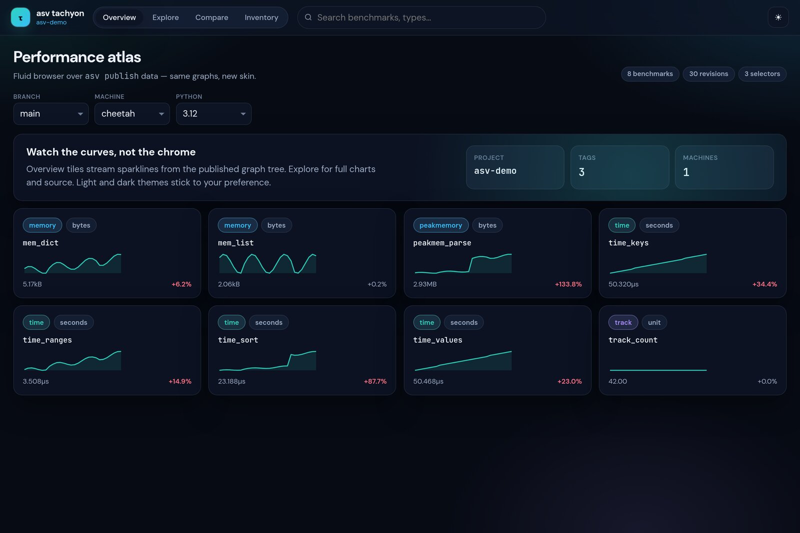
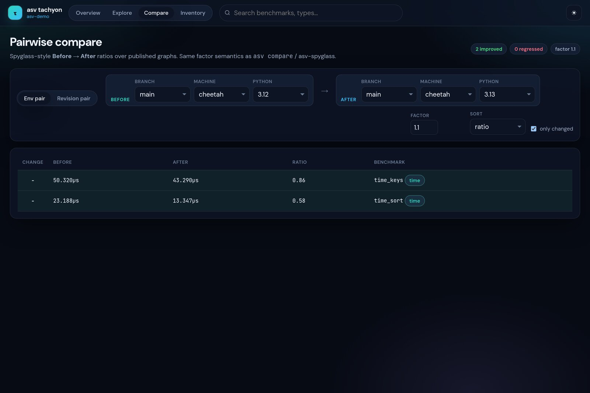
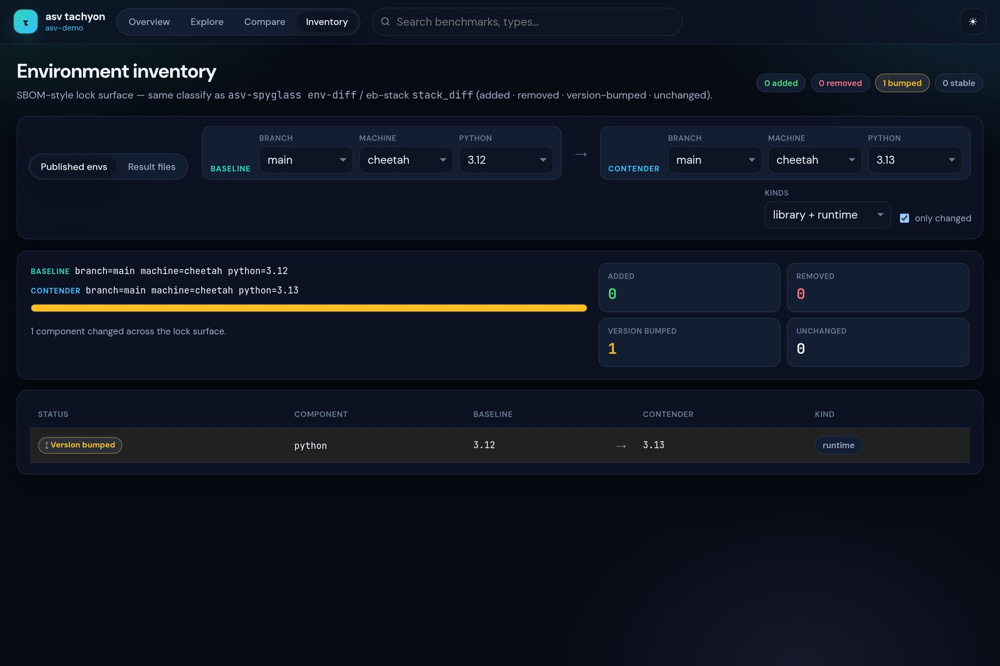
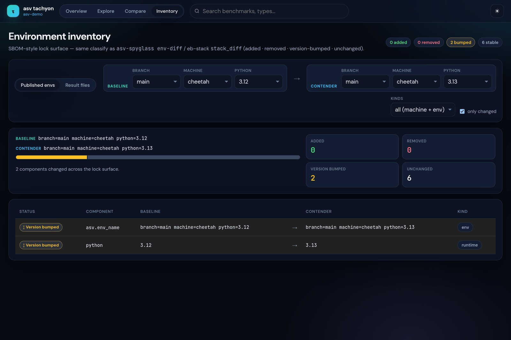

Views
=====

Overview
--------

Sparkline tiles for every benchmark, filtered by the published ``params``
(machine, branch, python, …). Search matches name or type.

Explore
-------

Full uPlot series for a single benchmark. Env filters (machine, branch, python,
…) are **preserved** when switching benchmarks; the URL hash records view,
selected bench, and filters for shareable links.

When a benchmark declares ``params``, each flat param combination is a separate
series with a **stable color** (hiding a series does not reshuffle the palette).
Toggle series from the param chip row.

Compare
-------

Spyglass-style ratios with the same factor semantics as ``asv compare`` /
asv-spyglass ``compare-many``. Modes:

* **Env columns** — select N entries from ``graph_param_list`` (first selected
  is the baseline; each further env is a contender column with value + ratio)
* **Revision pair** — two commits on one env surface

Factor default is ``1.1``. Click a row for an overlay chart of the first two
env series.

Regressions
-----------

Loads optional ``regressions.json`` (same 7-tuple feed as the stock ASV site).
Factor slider / number input filters rows by ``last/best``. Click a row to open
Explore with the env filters and param index applied.

Inventory
---------

SBOM-style lock surface (mirrors ``asv-spyglass env-diff`` / eb-stack
``stack_diff``):

* **Published envs** — diff ``params`` + machine facts from ``index.json``
* **Result files** — drop two raw ASV result JSON files for the full
  requirements matrix

Classifies each component as *added*, *removed*, *version-bumped*, or
*unchanged*, with KPI cards and a stacked mix bar.

*All kinds* also surfaces env name and machine attributes when they differ.
